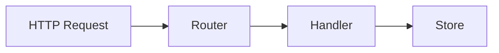

# Architecture Documentation (Task 1)

## Intro
This branch implements a RESTful Product Catalog API as a microservice.

## Request Flow

1. HTTP Request
Client sends HTTP request to the API.
2. Router
- The file `cmd/api/main.go` is used to start the HTTP server and registers routes.
- The router matches incoming requests to handler methods in the file `internal/handler/handler.go`.
3. Handler
The handler validates the input and delegates data operations to the store.
4. Store
The store performs CRUD operations against the storage backend.
5. Database
The data layer reads/writes from the storage backend (memory or database).

### Diagram

## Compare MemoryStore vs PostgresStore

### When to use MemoryStore?
- During local development and simple exercise or prototype work
- When persistence between restarts is not required
- For fast feedback loops in tests or demos
- When running on a single instance with no need for shared state

### When to use PostgresStore?
- In production or staging environments where data must persist
- When multiple instances of the service need to share the same product data
- When transactional integrity and query capabilities are required
- When the service must survive process restarts and deploy cycles

### What are Trade-offs?

`MemoryStore`
- Data is lost on restart
- Not suitable for scaling across multiple instances
- Doens't support SQL querying, transactions, or durability

`PostgresStore`
- Requires PostgreSQL infrastructure
- Much more complex setup and configuration
- Higher operational overhead

## Addtional Info

- User mermaid from Github Diagrams docu https://docs.github.com/en/get-started/writing-on-github/working-with-advanced-formatting/creating-diagrams for formatting the diagram (hopefully correctly)
